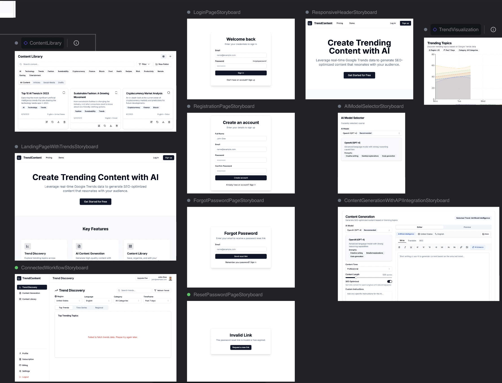

# Google Trends Content Generator

A comprehensive SaaS platform that leverages real-time Google Trends data to help content creators generate SEO-optimized content across multiple languages and regions.



## Features

- **Trend Discovery Dashboard**: Interactive visualizations of trending topics by country/language using google-trends-api with filters for timeframes and categories
- **AI Content Generation Interface**: Rich text editor with model selection (OpenAI, Gemini, Perplexity), tone/style controls, and one-click generation based on selected trends
- **Content Library**: Save, organize, and edit generated content with keyword tagging and search functionality
- **Multi-language Support**: Translation preview and region-specific SEO recommendations
- **Integration Options**: WordPress, social media platforms, and content calendars via API/webhooks

## Tech Stack

- React + TypeScript + Vite
- Tailwind CSS with Shadcn UI components
- Google Trends API integration
- Multiple AI model integrations (OpenAI, Gemini, Perplexity)

## Getting Started

### Prerequisites

- Node.js (v16 or higher)
- npm or yarn

### Installation

```bash
# Clone the repository
git clone <repository-url>
cd google-trends-content-generator

# Install dependencies
npm install
# or
yarn install

# Start the development server
npm run dev
# or
yarn dev
```

### Environment Variables

Create a `.env` file in the root directory with the following variables:

```
VITE_OPENAI_API_KEY=your_openai_api_key
VITE_GEMINI_API_KEY=your_gemini_api_key
VITE_PERPLEXITY_API_KEY=your_perplexity_api_key
```

## Usage

1. **Discover Trends**: Use the Trend Discovery Dashboard to find trending topics in your region and category
2. **Generate Content**: Select a trend and use the AI Content Generation Interface to create content
3. **Customize**: Edit the generated content using the Rich Text Editor
4. **Save & Organize**: Store your content in the Content Library for future use
5. **Export & Share**: Integrate with WordPress, social media, or content calendars

## License

MIT
